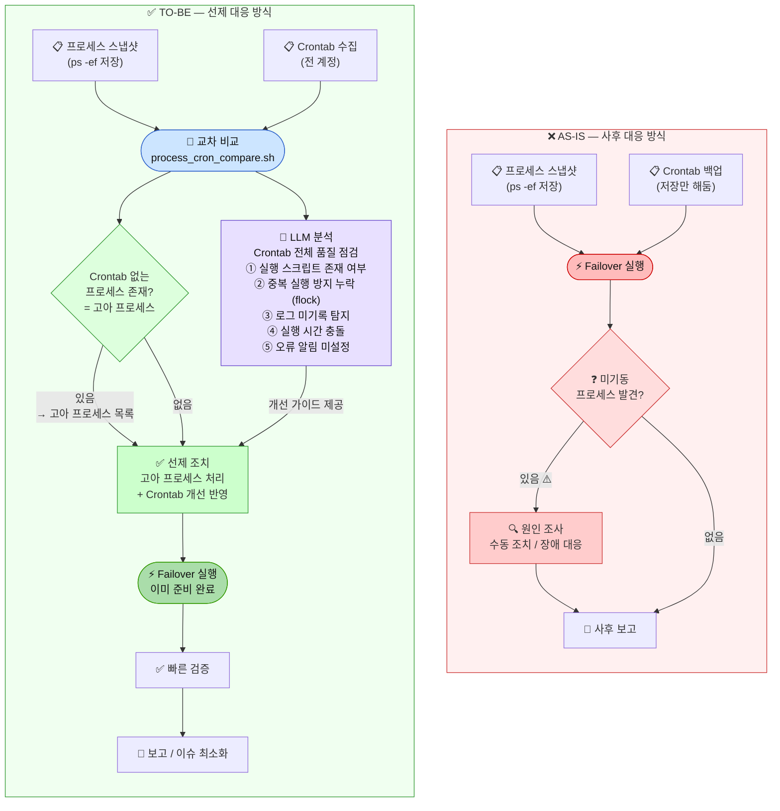
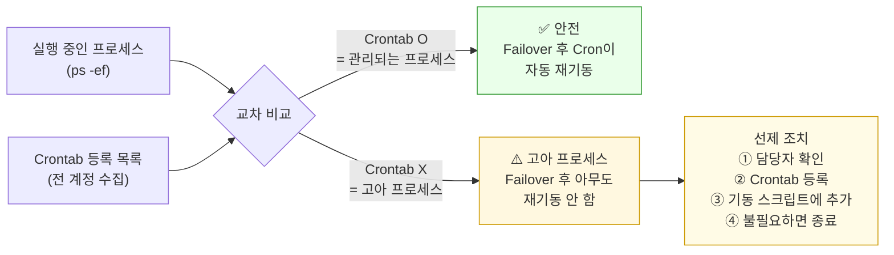

# 08. Failover 대응 방식 개선 — AS-IS vs TO-BE

> **핵심 변화**: 사후 발견(Reactive) → 사전 예방(Proactive) + 🤖 LLM Crontab 품질 점검

---

## AS-IS vs TO-BE 프로세스 비교

---

## 무엇이 달라지는가

| | AS-IS | TO-BE |
|--|-------|-------|
| **비교 시점** | Failover **이후** | Failover **이전** |
| **고아 프로세스** | Failover 후 발견 | 사전 탐지·조치 |
| **Crontab 품질** | 확인 안 함 | 🤖 LLM이 자동 점검 |
| **문제 발견** | 장애 발생 후 | 작업 전 인지 |
| **담당자 확인** | Failover 중 (긴박) | Failover 전 (여유) |
| **대응 방식** | 긴급 수동 조치 | 선제 계획 수립 |

---

## 고아 프로세스란?

