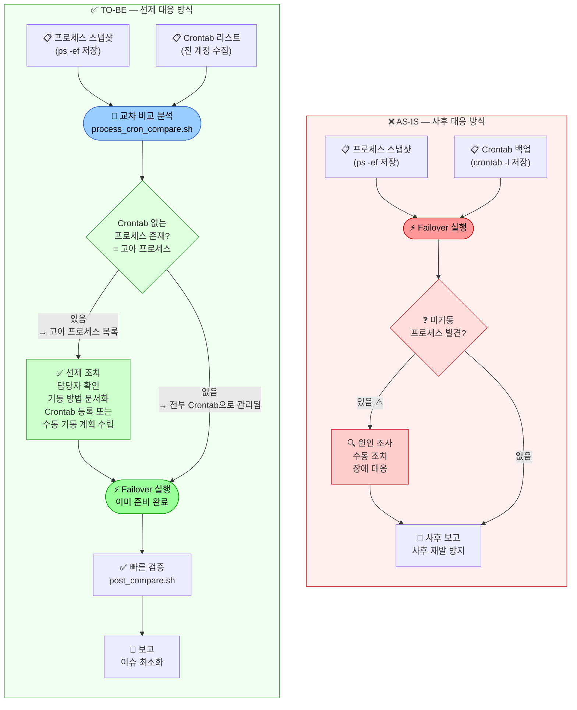
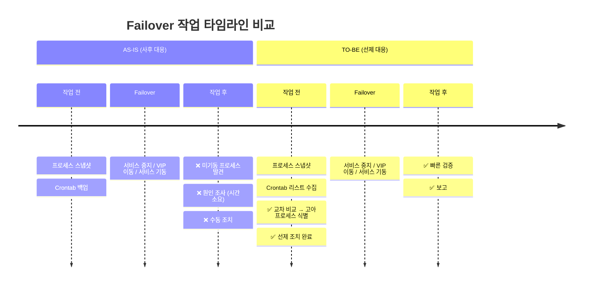
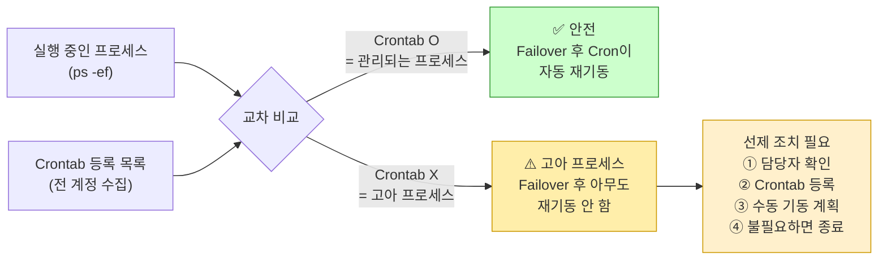

# 08. Failover 대응 방식 개선 — AS-IS vs TO-BE

> **핵심 변화**: 사후 발견(Reactive) → 사전 예방(Proactive)
>
> 비교 시점이 **Failover 이후**에서 **Failover 이전**으로 앞당겨진다.

---

## AS-IS vs TO-BE 프로세스 비교 다이어그램



---

## 무엇이 달라지는가



---

## 핵심 개념 — "고아 프로세스(Orphan Process)"



---

## 개선 효과 비교

| 항목 | AS-IS | TO-BE |
|------|-------|-------|
| 비교 시점 | Failover **이후** | Failover **이전** |
| 문제 발견 시점 | 장애 발생 후 | 작업 전 사전 인지 |
| 대응 방식 | 사후 수동 조치 | 선제 계획 수립 |
| 작업 중 긴급 대응 | 빈번히 발생 | 최소화 |
| Failover 시간 예측 | 불확실 | 예측 가능 |
| 담당자 확인 시점 | Failover 후 (긴박한 상황) | Failover 전 (여유 있는 상황) |
| 미기동 프로세스 위험 | 높음 | 낮음 |

---

## 실행 방법

```bash
# STEP 1: Failover 전에 실행 (양산 영향 없음)
bash scripts/process_cron_compare.sh

# STEP 2: 출력된 고아 프로세스 목록 확인
cat /tmp/orphan_process_report_*.txt

# STEP 3: 각 고아 프로세스에 대해 담당자 확인 및 조치 결정
# → Crontab 등록 / 수동 기동 계획 / 불필요 시 종료

# STEP 4: 조치 완료 후 Failover 진행
```

> 스크립트 위치: `scripts/process_cron_compare.sh`
> 상세 설명: 스크립트 내 주석 참고
