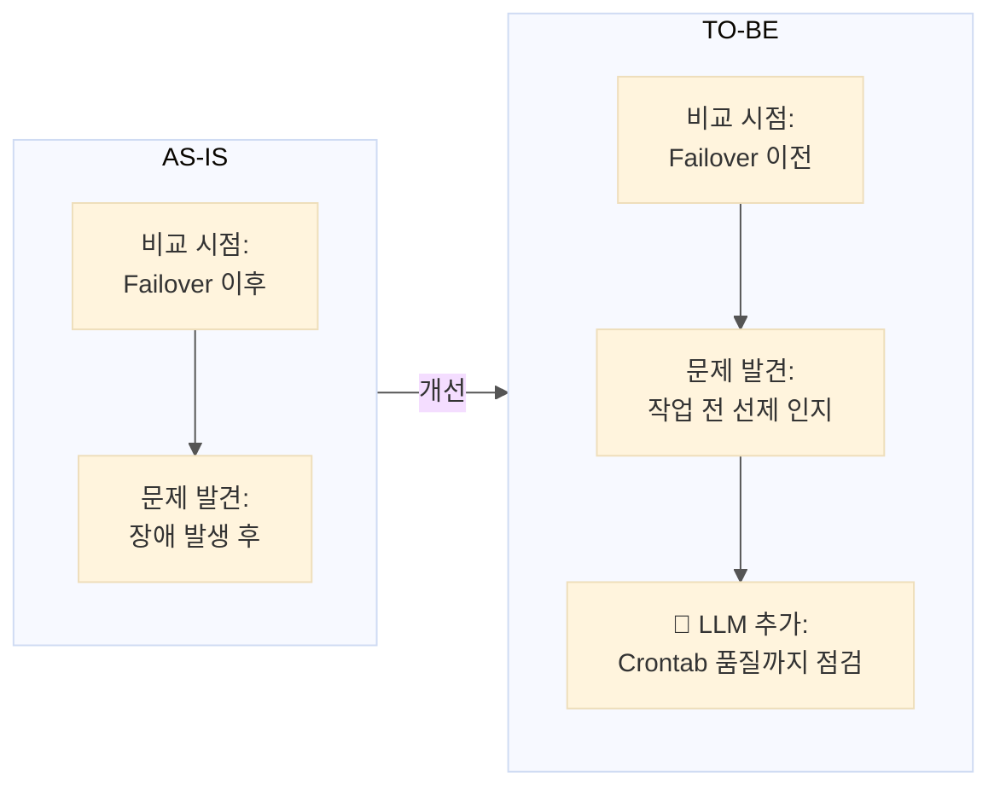
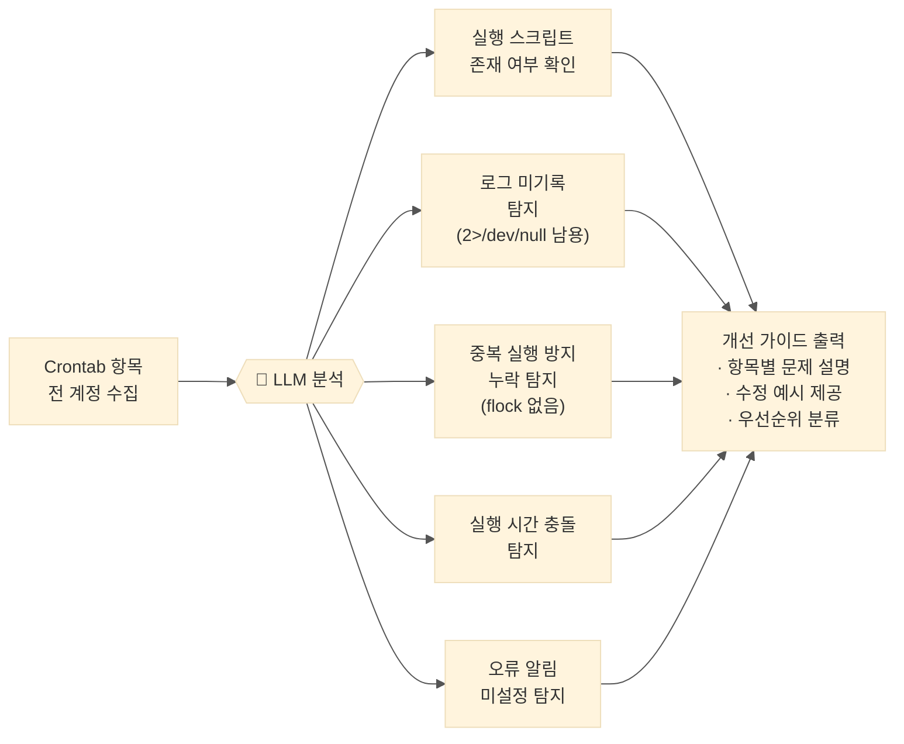

# 08. Failover 대응 방식 개선 — AS-IS vs TO-BE

---

## 전체 흐름 비교 (가로 레인)

```mermaid
%%{init: {'theme': 'base', 'themeVariables': {'fontSize': '15px', 'primaryColor': '#ECECEC', 'primaryTextColor': '#1a1a1a', 'primaryBorderColor': '#888', 'lineColor': '#555', 'secondaryColor': '#f9f9f9', 'tertiaryColor': '#fff'}}}%%
flowchart TD

    subgraph ASIS["  AS-IS  ·  사후 대응  "]
        direction LR
        a1([작업 전])
        a2["프로세스 목록\n수집"]
        a3["Crontab\n백업"]
        a4(["⚡ Failover"])
        a5["미기동 프로세스\n발견"]
        a6["원인 조사\n수동 조치"]
        a7([완료 · 보고])

        a1 --> a2 --> a3 --> a4 --> a5 --> a6 --> a7
    end

    subgraph TOBE["  TO-BE  ·  선제 대응  "]
        direction LR
        b1([작업 전])
        b2["프로세스 목록\n수집"]
        b3["Crontab\n수집"]
        b4["교차 비교\n고아 프로세스 탐지"]
        b5{{"🤖 LLM 분석\nCrontab 문제 발굴\n개선 가이드 제공"}}
        b6["선제 조치\n계획 수립"]
        b7(["⚡ Failover"])
        b8["빠른 검증"]
        b9([완료 · 보고])

        b1 --> b2 --> b3 --> b4 --> b5 --> b6 --> b7 --> b8 --> b9
    end
```

---

## 핵심 차이 — 비교 시점

---

## 🤖 LLM 분석 단계 상세

---

## 개선 효과 요약

| | AS-IS | TO-BE |
|--|-------|-------|
| **비교 시점** | Failover 이후 | Failover 이전 |
| **문제 발견** | 장애 발생 후 | 사전 인지 |
| **Crontab 품질** | 확인 안 함 | 🤖 LLM이 자동 점검 |
| **대응 방식** | 긴급 수동 조치 | 선제 계획 수립 |
| **담당자 확인** | Failover 중 (긴박) | Failover 전 (여유) |
| **고아 프로세스** | Failover 후 발견 | 사전 탐지·조치 |
