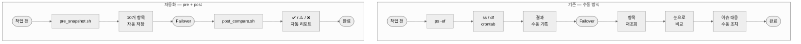
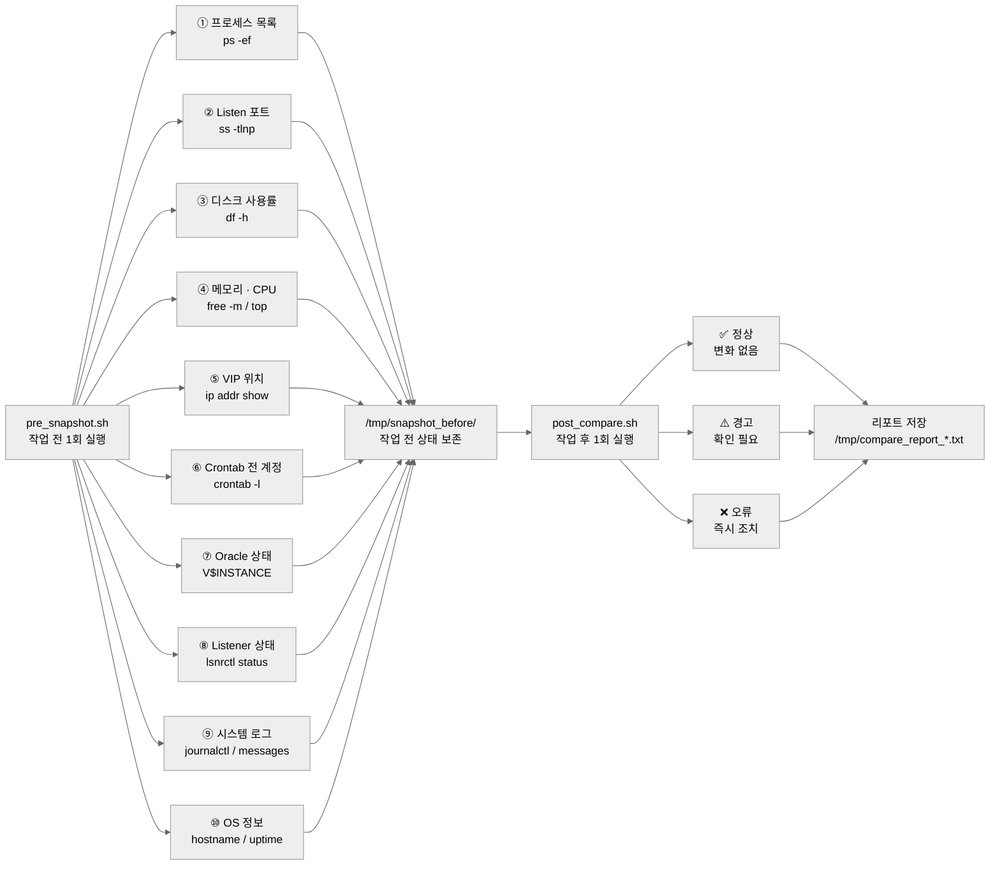
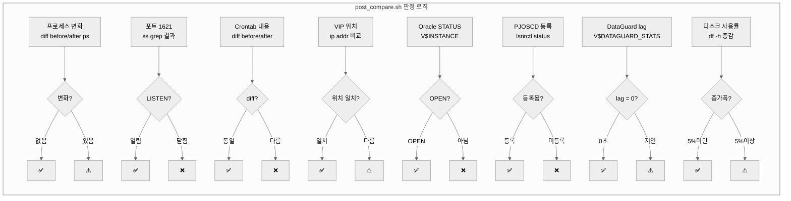

# 09. 점검 자동화 — pre_snapshot + post_compare

> **핵심**: 사람이 기억에 의존해 수동으로 비교하던 것을
> 스크립트 2번 실행으로 대체한다.

---

## 1. 워크플로우 비교



---

## 2. 자동 수집·비교 항목



---

## 3. 비교 항목별 판정 방식



---

## 4. 효과 비교

| 항목 | 수동 방식 | pre + post 자동화 |
|------|-----------|-------------------|
| 작업 전 소요 시간 | 15 ~ 30분 | 1분 (스크립트 실행) |
| 작업 후 소요 시간 | 20 ~ 40분 | 1분 (스크립트 실행) |
| 비교 항목 수 | 담당자마다 다름 | 매번 동일한 10개 항목 |
| 비교 방법 | 기억 / 메모 의존 | diff 기반 정량 비교 |
| 누락 가능성 | 높음 | 없음 |
| 결과 기록 | 수동 작성 | 자동 파일 저장 |
| 판정 기준 | 주관적 | ✅ / ⚠️ / ❌ 명확 |
| 재현성 | 담당자에 따라 편차 | 누가 실행해도 동일 |
| 보고서 활용 | 별도 정리 필요 | 리포트 파일 바로 첨부 |

---

## 5. 실행 한 눈에 보기

```
  [D-Day 12:30]

    bash pre_snapshot.sh
    └─ 10개 항목 수집 완료
       저장: /tmp/snapshot_before/

  [Failover 실행]

  [완료 후]

    bash post_compare.sh
    └─ 전·후 자동 비교
       ✅ 정상: 7   ⚠️ 경고: 1   ❌ 오류: 0
       저장: /tmp/compare_report_20250713_1620.txt
```
